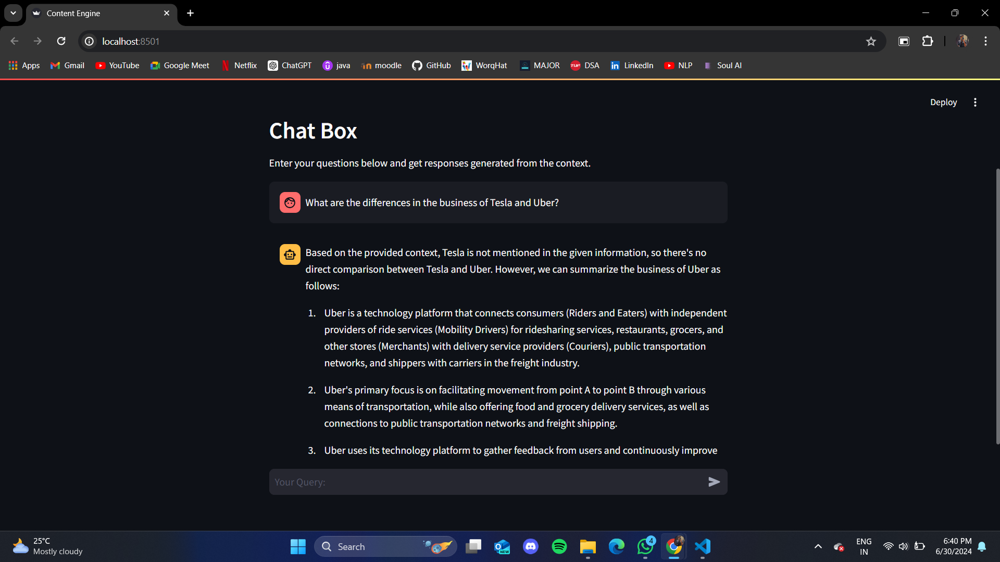

# Content Engine 🧠

## Overview

The **Content Engine** is a Streamlit-based application designed to analyze and compare multiple PDF documents using Retrieval Augmented Generation (RAG) techniques. It retrieves, assesses, and generates insights from documents to highlight their differences effectively.

## Features

- **Database Population:** Easily populate the database with PDF documents.
- **Interactive Chat Box:** Enter queries and receive context-based responses.
- **Built-in Retrieval and Generation:** Utilizes LangChain's capabilities for powerful document analysis.

## Setup

To run the Content Engine on your local machine, follow these steps:

1. **Clone the repository:**

   ```bash
   git clone https://github.com/GLITCH-08/RAG-Application.git
   cd content-engine
   ```
2. **Install dependencies:**

   ```bash
   pip install -r requirements.txt
   ```
3. **Run the application:**
   ```bash
   streamlit run app.py
  
4. **Interact with the application:**
   
   1. **The app when it loads:** You see an app with a place to enter your query.
   
      
   
   2. **User sends response:** User can enter any response to ask questions from the PDF.
   
      
   
   3. **LLM sends response:** LLM reads and understands the context and the question to give response back to the user.
   
      
  
  
   
